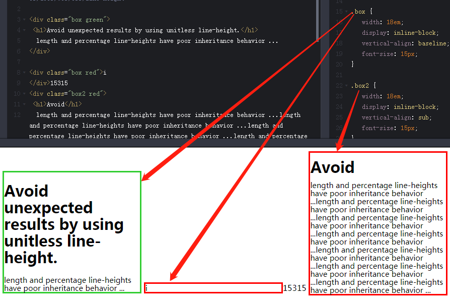

# 样式基础

## 盒模型

### 概念

当对一个文档进行布局的时候，浏览器渲染引擎会根据CSS-Box模型（CSS Basic Box model）将所有元素表示为一个矩形盒子，这样的盒子具有 内容区域(Content)、内边距区域(Padding)、边框区域(Border)和外边距区域(Margin)，如图所示：


基于该盒模型，CSS的width属性计算又依据两套标准：

```
标准模型(content-box)：
	该标准下，CSS设置的盒宽度 = content 宽度
IE模型(怪异模型)(border-box)：
	该标准下，CSS设置的盒宽度 = (content + padding + border) 宽度
```

在CSS3中可以通过box-sizing改变盒宽计算标准，box-sizing: content-box | border-box | inherit

### 相关术语

通过MDN文档，可以看到许多易混淆且难理解的术语，特此总结：

* 替换元素

  浏览器根据元素的标签和属性，来决定元素的具体显示内容，例如 img,input,select 等元素。

* 非替换元素

  非替换元素通常将内嵌内容直接显示于文档中，例如 span,a,div 等元素。

* 块级元素

  即 display 为 block、list-item、table的元素。一个块级元素会被格式化成一个块（例如文章的一个段落），默认按照垂直方向依次排列。

* 块级盒

  每个块级元素都至少生成一个块级盒子，即主块级盒子。每个块级盒子都会参与块格式化上下文（BFC）的创建。有些块级元素除了产生主块级盒，也可能产生额外的盒，比如display属性值为“list-item”的元素。产生的额外的盒用来包含项目符号（可以用list-style-position属性设置额外的盒是放在主块级盒内还是外）

* 行内级元素

  即 display 为 inline、inline-block、inline-table 的元素。

* 行内级盒

  行内级元素产生行内级盒，而行内级盒根据是否参与行内格式上下文（IFC）的创建又分为行内盒与原子级行内盒。

* 行盒

  在行内格式化上下文中,盒从包含块的顶部一个接一个地水平摆放。包含了一行里所有盒的矩形区域被称为行盒，一个段落就是多个行盒的垂直堆叠。


## BFC/IFC

**块级盒**会参与形成**BFC（块级格式化上下文）**，比如display值为block，list-item，table的元素；**行级盒**会参与形成**IFC（行内级格式化上下文）**，比如display值为inline，inline-table，inline-block的元素

### BFC布局规则

* 内部的盒子会在垂直方向，一个个地放置；
* 盒子垂直方向的距离由margin决定，属于同一个BFC的两个相邻Box的上下margin会发生重叠；
* 每个元素的左边，与包含的盒子的左边相接触，即使存在浮动也是如此；
* BFC的区域不会与float重叠；
* BFC就是页面上的一个隔离的独立容器，容器里面的子元素不会影响到外面的元素，反之也如此；
* 计算BFC的高度时，浮动元素也参与计算。

### BFC形成方式

* 根元素；
* float的属性不为none；
* position为absolute或fixed；
* display为inline-block，table-cell，table-caption，flex；
* overflow不为visible。


## 选择器

### 浏览器选择器优先级规则


> 例子：#nav-global > ul > li > a.nav-link
>
> 因为没有内联样式，故A = 0；
> ID选择器总共出现了1次，B = 1；
> 类选择器1次，属性选择器0次，伪类选择器0次，所以 C = 1 + 0 + 0 = 1；
> 标签选择器3次， 伪元素0次，所以 D = (3 + 0) = 3
>
> 即（0, 1, 1, 3）

### 选择器解析顺序

CSS选择器是**从右往左**解析的。

给出如下一段HTML：

```html
<div id="div1">
    <div class="a">
        <div class="b">
            ...
        </div>
        <div class="c">
            <div class="d">
                ...
            </div>
            <div class="e">
                ...
            </div>
        </div>
    </div>
    <div class="f">
        <div class="c">
            <div class="d">
                ...
            </div>
        </div>
    </div>
</div>
```

给出如下CSS样式声明：

```css
#div1 .c .d {}
.f .c .d {}
.a .c .e {}
#div1 .f {}
.c .d{}
```

假如我们的CSS解析器是**从左往右**进行匹配的，则会生成如下样式树：


可以看出`#div1 .c .d{}`， `.f .c .d{}`，`.c .d{}`这三个选择器里面都含有` .c .d{}`公用样式。因此即使我们的DOM节点已经明确了，在计算该DOM所拥有的样式时，仍需遍历整个样式树。性能不佳。

而当CSS解析顺序为**从右向左**时，将生成样式树：


不仅树节点少了，且在遍历性能上也能得到提升。


## 常见CSS细节问题

### line-height的继承

line-height即为行高，不支持负值：

  ```
  line-height可取值：normal | inherit | 纯数字 | 百分比 | 具体length
  
  当被定义为normal时：		行高将使用默认值，约纯数字1.2左右
  当被定义为inherit时：		将继承自父元素行高
  当被定义为纯数字时：		  即为当前字体大小的数字倍
  当被定义为百分比时：		  即纯数字的百分比版本
  当被定义为具体length时：	   即为具体值
  
  在继承上的体现：
  1. 父元素行高为具体length时，子元素均按此值继承
  2. 父元素行高为百分比时，子元素将继承父元素百分比算出来的具体值，而不会根据自身字体大小计算行高
  3. 父元素行高为纯数字和normal时，子元素均会根据自身字体大小计算该数字倍数相应的行高
  ```

### vertical-align

该属性针对于行内级元素（inline, inline-block）的纵向对齐方式：


| vertical-align 取值 | 位置                                                |
| ------------------- | --------------------------------------------------- |
| baseline            | **默认**，元素放置在父元素的基线上                  |
| sub                 | 垂直对齐文本的下标                                  |
| super               | 垂直对齐文本的上标                                  |
| top                 | 把元素的顶端与行中最高的元素的顶端对齐              |
| text-top            | 把元素的顶端与top line对齐                          |
| middle              | 把元素放置在父元素的中部                            |
| bottom              | 把元素的顶端与行中最低的元素的顶端对齐              |
| text-bottom         | 把元素的底端与bottom line对齐                       |
| length              | 基于基线往上的距离                                  |
| %                   | 使用“line-height”属性的百分比值来排列元素，允许负值 |
| inherit             | 继承于父元素的vertical-align                        |

`vertical-align: baseline`可以理解为将该行内级元素的baseline与该行正常DOM文本节点的基线对齐，对于该元素的baseline有以下规则：

* inline-table元素的baseline是它的table第一行的baseline；
* 对于是行盒的父元素，baseline是最后一个inline元素的baseline；
* inline-block元素如果内部有正常流内容（文字等），baseline取最后一个内容的baseline；
* inline-block元素若内部无流内容，baseline取它的底外边距边缘；
* inline-block如果设置了overflow不为visible，baseline取它的底外边距边缘。



参考：<a href="https://christopheraue.net/design/vertical-align" target="_blank">文章1</a> 和 <a href="https://www.cnblogs.com/starof/p/4512284.html?utm_source=tuicool&utm_medium=referral" target="_blank">文章2</a>

### width: 100% VS width: auto

width: 100%意味着content box撑满父容器的content box，而width: auto则是content + padding + border + margin 撑满父容器的content box。

### white-space & word-break & word-wrap

white-space：可以控制**空白字符**的显示及**语句**的换行（若单词过长会溢出）

word-break：可以控制单词内部的换行（是否在连字符、空格间换行或溢出则换行）

word-wrap (overflow-wrap)：可以实现`只有当一个单词一整行都显示不下时，才会拆分换行该单词`效果

### 百分比基准

1. 子元素的宽高设置百分比是基于父元素的宽高；
2. margin: 10% 10%中两个10%均基于父元素**宽度**计算，padding同理；
3. 在translate中设置的百分比是基于自身的宽高。

### 行内元素空隙问题

1. 设置font-size: 0；
2. 行内间隙即基线到底线间隙，可用vertical-align: bottom；
3. 利用HTML注释`<!-- -->`。


## 浮动

浮动的盒子可以向左或向右移动，直到它的外边缘碰到包含它的盒子或另一个浮动盒子的边框为止。由于浮动盒子不在文档的普通流中，所以文档的普通流中的块盒子表现得就像浮动盒子不存在一样。需注意：

* 一行内，显示不下所有的已浮动元素时，最后一个将换行；
* 元素一旦浮动起来之后，那么宽度将变成自适应(宽度由内容决定)；
* 元素一旦浮动起来之后，那么就将变成块级元素,尤其对行内元素，影响最大；
* 文本、行内元素、行内块元素是采用环绕的方式来排列的，故会巧妙的避开浮动元素而不被压在底下。

### 清除浮动

clear 属性规定元素的哪一侧不允许其他浮动元素。通常清除浮动有以下几种方式：

* 父元素内追加子元素并设置`clear: both;`，然而该方式会增加无意义标签；

* 为父元素设置overflow而产生BFC，使浮动元素高度也被计算在内；

* 为父元素设置伪类（也可通过原子类方式设置）：

  ```css
  .parent:after {
    content: "";
    display: block;
    clear: both;
    visibility: hidden;
  }
  ```

  或

  ```css
  .parent:after {
    content: "";
    display: table;
  }
  /*
  display:table本身无法触发BFC，但是它会产生匿名框(anonymous boxes)，而匿名框中的display:table-cell可以触发BFC，简单说就是，触发块级格式化上下文的是匿名框，而不是display:table。所以通过display:table和display:table-cell创建的BFC效果是不一样的
  */
  ```

  