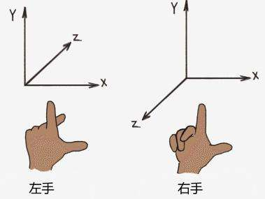
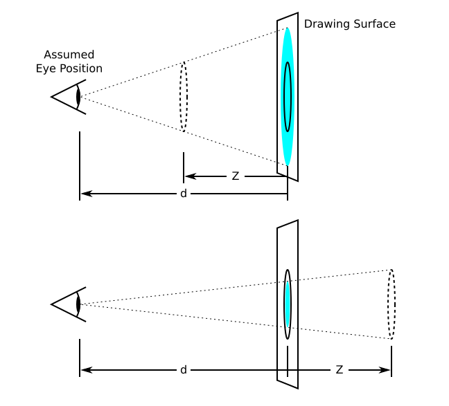
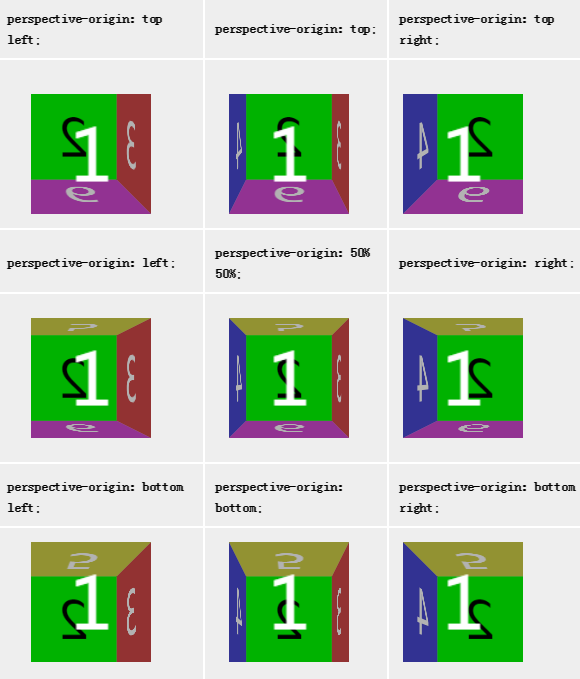
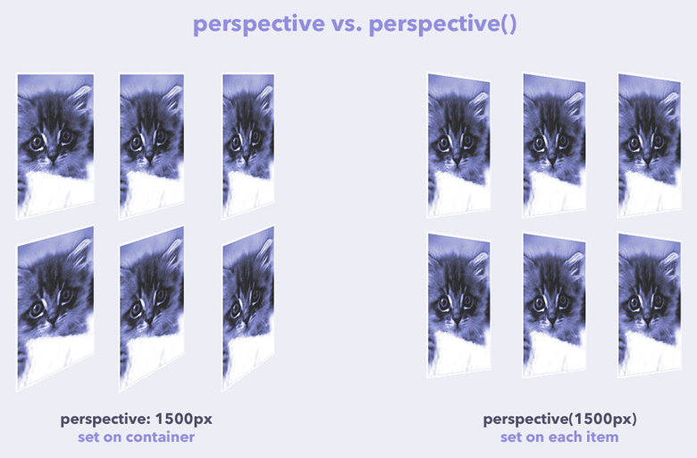

# CSS3

## CSS3视图

### transform与CSS3坐标系

CSS3采用的是左手坐标系，**且x轴正方向为屏幕朝右，y轴正方向为屏幕朝下**：



在做transform旋转变换时，每个图形是基于变换原点( transform-origin )作变换的，其中百分比基于应用元素的宽度/高度进行计算：

```css
/* x-offset | y-offset | z-offset */
transform-origin: 2px 30% 10px;
/* x-offset-keyword | y-offset-keyword */
transform-origin: right top;
/* y-offset-keyword | x-offset-keyword */
transform-origin: top right;
/*Default Value*/
transform-origin: 50% 50% 0; 
```

值得注意的是，在作rotate旋转变换时，**坐标轴也会跟着图形旋转**。

### prespective & perspective-origin

在CSS3的3D变换例如旋转中，若设置上perspective样式便可实现近大远小的视觉效果。



如图所示，Drawing Surface即为电脑屏幕，d 值便是perspective的大小值，z 值可表示物体在z轴上作变换 translateZ 之后距离屏幕的位置，初始值为 0。可以理解为，当不加上perspective样式时是没有视点投影的，像是数学中对物体的主视图。而加上该样式后的图形效果便会显示为从一个视点对图像的投影效果。

显然，视点的位置可以通过使用 perspective-origin作改变：

```css
/* One-value syntax */
perspective-origin: x-position;
/* Two-value syntax */
perspective-origin: x-position y-position;
/* Global values */
perspective-origin: inherit;
perspective-origin: initial;
perspective-origin: unset;
/* Default Value */
perspective-origin: 50% 50%;
```

其中 x - 50% 指所应用元素的宽度的50%，y - 50%则同理。更多应用效果如图：



perspective-origin又称3D空间的消失点，**按笔者的理解是图形在 z → - ∞ 时候的图形点**。

此外，perspective有两种应用方式：

* 在父元素上声明样式

  ```css
  .container {
      perspective: 1800px;
  }
  .container .child {
      /*...*/
  }
  ```

* 在局部子元素transform变换中调用perspective()方法声明样式

```css
.container {
    /*...*/
}
.container .child {
    /*...*/
    transform: perspective(1800px) /* more... */;
}
```

如果元素不共享相同的三维空间，则每个元素都有自己的消失点( perspective-origin )。因此，使用perspective()将导致每个元素都有自己的空间及它自己的消失点。如果想让它们共享相同的三维空间，应在父容器上使用perspective属性。



### transform-style

该样式可能的取值有 flat 和 preserve-3d。前者将元素视为 2D平面，而后者为元素构建空间感。两种取值的区别可查看<a href="http://www.runoob.com/try/try.php?filename=trycss3_transform-style_inuse" target="_blank">案例</a>。

### prespective 与 perserve-3d 的区别

按笔者的理解，以立方体 ( 其内包含6个div作为6个面 ) 为例。使用 prespective 样式构建的是立方体外部的视觉空间感，而使用 perserve-3d 则是构建该立方体6个div的内部空间感，使立方体不再是平面立方体。