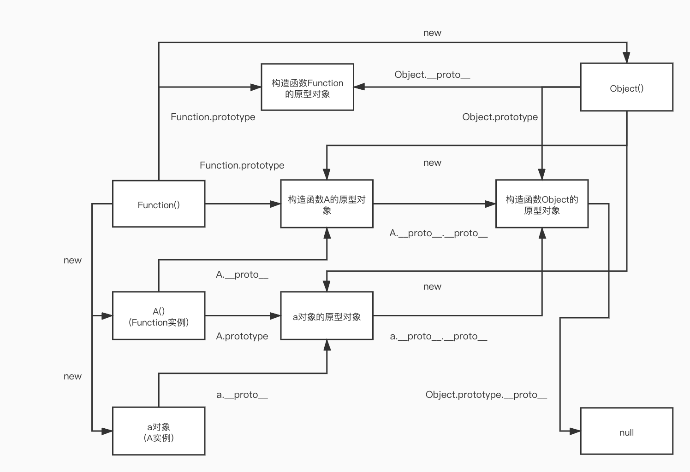

# JavaScript核心

## 变量与函数

### var 关键字

Javascript中的作用域为函数作用域，用var定义的变量即显式声明该作用域中的变量，若为隐式声明则会变成全局变量，对于全局变量，将成为浏览器中window对象中的属性。此外，在全局域中用Var显式声明的变量不能用Delete删除。

### 变量提升与函数提升

* JavaScript中，函数及变量的声明都将被提升到函数的最顶部。
* JavaScript中，变量可以在使用后声明，也就是变量可以先使用再声明（let const关键字除外）。

```js
var x = 5; // 初始化 x
elem = document.getElementById("demo"); // 查找元素 
elem.innerHTML = x + " " + y;           // 显示 x 和 y
var y = 7; // 初始化 y

/* ***上述代码将如下述般执行*** */

var x = 5; // 初始化 x
var y;     // 声明 y
elem = document.getElementById("demo"); // 查找元素
elem.innerHTML = x + " " + y;           // 显示 x 和 y
y = 7;    // 设置 y 为 7
```

js中创建函数有两种方式：函数声明式和函数字面量式。只有函数声明才存在函数提升！如: 

```js
console.log(f1); // function f1() {}   
console.log(f2); // undefined  
function f1() {}
var f2 = function() {}
```

### 闭包

闭包是函数和声明该函数的词法环境的组合。常见函数闭包与对象闭包：

```js
// 函数闭包：
function outer(){
    function inner(){} 
}
// 对象闭包：
var a = {
    f: function(){console.log(this);} // 即对象 a
}
```

### 作用域链

每个函数都有自己的执行环境，其中 **执行环境定义了变量或函数有权访问的其他数据，而每个执行环境都有一个与之关联的变量对象，环境中定义的所有变量和函数都保存在这个变量** 中，虽然我们无法访问这个对象，但解析器在处理数据时会在后台使用它。当执行流进入一个函数时，函数的环境便会被推入一个环境栈中，执行完毕后栈再将其环境弹出，把控制权返回给之前的执行环境。

当代码在一个环境中执行时，会创建变量对象的一个作用域链以保证对执行环境有权访问的所有变量及函数的有序访问。**作用域前端始终是当前执行代码所在的`环境对象`**。如果这个环境是函数，则将其活动对象作为变量对象，活动对象最开始只包含一个变量 (即**`arguments`**对象)。作用域链中下一个变量对象来自外部环境，而再下一个变量对象则来自下一个包含环境，这样便一直顺延到全局执行环境。全局执行环境的变量对象即**`window`**对象始终是作用域链中的最后一个对象。

详细可参考：**https://segmentfault.com/a/1190000008042501**


## 对象

### 创建对象的方式

在Javascript中创建一个对象是非常容易的，方式可总结为如下几种：

* 对象字面量

  以下的定义方式均是合法的：

  ```js
  /*常规定义*/
  var person = {
      name: 'Tom',
      age: 29
  };
  /*属性名也可以为字符串或数字甚至undefined*/
  var obj = {
      'T': 'Tom',
      555: 666,
      undefined: 777
  };
  obj['T'];	// Tom
  obj[T];		// Uncaught ReferenceError: T is not defined
  obj[555];	// 666
  obj.555; 	// Error
  obj['555']; // 666
  obj['undefined'];	// 777
  var temp;
  obj[temp];			// 777
  ```

  定义对象时，这里的键名会自动转换为字符串。

* 工厂模式

  ```js
  function createObj(attr){
      var o = new Object();
      o.attr = attr;
      o.method = function(){};
      return o;
  }
  ```

  通过调用该函数以获取返回的新对象，但每创建一个对象，就要耗费新的内存建立该对象的新方法，不能实现良好的空间利用性。

* 构造函数模式

  ```js
  function Person(name){
      this.name = name;
      this.method = function(){};
  }
  /* 构造函数配合new方式创建 */
  var p1 = new Person('Tom');
  var p2 = new Person('Petter');
  p1.constructor === Person; 			// true
  p1.constructor === p2.constructor; 	// true
  
  /* 直接调用，this指向windows */
  Person('Marry');
  window.name; 		// 'Marry'
  window.constructor; //  Window() { [native code] }
  /* 通过绑定执行环境调用 */
  var p4 = new Object();
  Person.call(p4, 'Bob');
  p4.constructor;		//  Object() { [native code] }
  ```

  通过new方式，每个创建出来的实例将有一个指向构造函数的属性constructor。并可见，构造函数模式依然无法实现共享资源。

* 构造+原型模式

  ```js
  function Person(name){
      this.name = name;
  }
  Person.prototype.method = function(){};
  ```

  利用在原型对象上添加方法实现资源共用，有关原型的总结见后。

* 稳妥构造函数模式

  ```js
  function Machine(p1, p2){
      var o = new Object();
      var p3 = 2*p1 / p2;
      o.getRatio = function(){return p3};
      return o;
  }
  var m = Machine(1.5, 4);
  m.p3;			// undefined
  m.getRatio();	// 0.75
  ```

  所谓稳妥对象指不含有公共属性，且其方法内部不用this的对象。对于其构造函数的调用将不用new的方式，于是便可在构造函数内定义一些私有变量或方法，形成一个安全的环境。

### 原型与原型链

JavaScript 常被描述为一种基于原型的语言——每个对象拥有一个原型对象，对象以其原型为模板、从原型继承方法和属性。原型对象也可能拥有原型，并从中继承方法和属性，一层一层、以此类推。这种关系常被称为原型链 (prototype chain)。

```js
var o = {};
console.dir(o);
/*
    {
        __proto__: {...}
    }
*/
```

在javascript中，函数可以有属性。 每个函数都有一个特殊的属性叫作原型，例：

```js
function doSomething(){}
console.log( doSomething.prototype );
/*
    {
        constructor: ƒ doSomething(),
        __proto__: {
            constructor: ƒ Object(),
            hasOwnProperty: ƒ hasOwnProperty(),
            isPrototypeOf: ƒ isPrototypeOf(),
            propertyIsEnumerable: ƒ propertyIsEnumerable(),
            toLocaleString: ƒ toLocaleString(),
            toString: ƒ toString(),
            valueOf: ƒ valueOf(),
            ...
        }
    }
*/
```

我们可以添加一些属性到 doSomething 的原型上面 ：

```js
doSomething.prototype.foo = "bar";
console.log( doSomething.prototype );
/*
    {
        foo: "bar",
        constructor: ƒ doSomething(),
        __proto__: {
            ...
        }
    }
*/
```

可以使用new关键字调用构造函数创建实例：

```js
function doSomething(){}
doSomething.prototype.foo = "bar";
var doSomeInstancing = new doSomething();
doSomeInstancing.prop = "some value";
console.log( doSomeInstancing );
/*
    {
        prop: "some value",
        __proto__: {
            foo: "bar",
            constructor: ƒ doSomething(),
            __proto__: {
                constructor: ƒ Object(),
                hasOwnProperty: ƒ hasOwnProperty(),
                isPrototypeOf: ƒ isPrototypeOf(),
                propertyIsEnumerable: ƒ propertyIsEnumerable(),
                toLocaleString: ƒ toLocaleString(),
                toString: ƒ toString(),
                valueOf: ƒ valueOf()
            }
        }
    }
*/
```

当使用new关键字调用构造函数创建对象时，将基于原型构造原型链。如上所见，实例`doSomeInstancing `的`__proto__`属性就是doSomething.prototype。当浏览器寻找对象属性时，首先查找对象本身是否有该属性，如果没有，浏览器便会在对象的`__proto__`中查找这个属性(也就是 doSomething.prototype)，如果有这个属性，那么`__proto__`上的这个属性就会被使用，否则将继续往上层的`__proto__`属性查找。此时将查找 doSomeInstancing 的`__proto__`的`__proto__`是否有这个属性。**默认情况下，所有函数的原型属性的`__proto__`就是`window.Object.prototype`**。所以此时`Object.prototype`会被查找是否有这个属性。最后，原型链上所有的`__proto__`都被找完了, 浏览器便得出结论，这个属性是 `undefined`。

用一个自定义构造函数A来说，对于普通用new创建的对象可得到如图关系：



**可以粗俗的理解为：原型对象相当于产品规格，实例即产品，构造函数则是生产机器，生产机器有它自己的产品规格（原型）和制造出生产机器的机器（构造函数）**

> 注意：
> 1. Object.prototype.\_\_proto\_\_是一个访问器属性。
> 2. 浏览器查找对象属性最终只到Object.prototype。

### 数据属性与访问器属性

在 ES5 中，属性分为数据属性和访问器属性。

* **数据属性**

  有四种描述其行为的特性：

  - [[Configurable]]：表示能否通过delete删除属性，能否修改属性特性，或能否把属性更改为访问器属性，默认值为true。**若设置为false，将不能再设置为true**。
  - [[Enumerable]]：表示能否通过for-in循环返回属性，默认值为true。
  - [[Writable]]：表示能否修改该属性的值，默认值为true。
  - [[Value]]：即该属性的数据值，默认为undefined。

  最简单地，下述代码便定义了一个obj对象的数据属性aaa：

  ```js
  var obj = {};
  obj.aaa = 123;
  
  /* 可根据ES5方法 
  	Object.getOwnPropertyDescriptor(对象, 属性名) 查看属性特性 */
  Object.getOwnPropertyDescriptor(obj, 'aaa');
  /* {value: 123, writable: true, 
  	enumerable: true, configurable: true} */
  
  /* 可根据ES5方法
  	Object.defineProperty(对象, 属性名, 描述符对象) 重定义属性特性 */
  Object.defineProperty(obj, 'aaa', {writable: false});
  obj.aaa = 888;
  obj;	// {aaa: 123}
  Object.defineProperty(obj, 'aaa', {writable: true});
  obj.aaa = 888;
  obj;	// {aaa: 888}
  ```

  在用Object.defineProperty定义属性时，**若不指定configurable, enumerable, writable将为false**。

* **访问器属性**

  访问器属性不能直接定义，**必须通过Object.defineProperty定义**。

  - [[Configurable]]：同数据属性。
  - [[Enumerable]]：同数据属性。
  - [[Get]]：在读取属性时调用的函数，默认为undefined。
  - [[Set]]：在写入属性时调用的函数，默认为undefined。

  如下定义了一个可以控制等级level、攻击力attack、血量hp的访问器属性_level：

  ```js
  var monster = {level:1, attack: 60, hp: 300};
  Object.defineProperty(monster, '_level', {
      configurable: true,
      get: function(){return this.level},
      set: function(newValue){
          if(typeof newValue === 'number' && newValue > 0){
              newValue = Math.ceil(newValue);
              this.level = newValue;			// 更新等级
              this.attack = 20*newValue + 40;	// 设定攻击力
              this.hp = newValue^2 + 50*newValue + 249; // 设定hp
          }
      }
  });
  monster._level = null; 
  // monster为 {level: 1, attack: 60, hp: 300}
  monster._level = 2;
  // monster为 {level: 2, attack: 80, hp: 349}
  monster._level = 2.22;
  // monster为 {level: 3, attack: 100, hp: 402}
  monster._level ++;
  // monster为 {level: 4, attack: 120, hp: 455}
  ```

  ES5 还引入了Object.defineProperties方法可以定义多个属性。

### 继承的方式

- **原型链继承**

  即 将子实例的构造函数原型指向父构造函数的实例

  ```js
  function Super(){this.superProp = 'super'}
  function Sub(){this.subProp = 'sub'}
  Sub.prototype = new Super();
  var subIns = new Sub();
  subIns.subProp;		// 'sub'
  subIns.superProp;	// 'super'
  /*	缺点：
  	① : 包含引用类型值的原型属性会被所有实例共享
  	② : 创建子类型的实例时，不能向超类型的构造函数中传递参数
  */
  ```

- **借用构造函数**

  ```js
  function Super(p1){this.superProp = 'super' + p1 + '*';}
  function Sub(){
      Super.call(this, 666);
  }
  var subIns = new Sub();
  subIns.superProp;	// 'super666*'
  /*	缺点：
  	在父类型的原型中定义的方法对子类型而言是不可见的
  */
  ```

- **组合继承（原型链 + 借用构造）**

  ```js
  function SuperType(name){
        this.name=name;
        this.colors=["red", "blue", "green"];
  }
  SuperType.prototype.sayName=function(){
        alert(this.name);
  };
  function SubType(name, age){
        //继承属性    使用借用构造函数实现对实例属性的继承
        SuperType.call(this,name);
        this.age=age;
  }
  //继承方法     使用原型链实现
  SubType.prototype=new SuperType();
  SubType.prototype.constructor=SubType;
  SubType.prototype.sayAge=function(){
        alert(this.age);
  };
  /*	...	*/
  ```

- **原型继承等等**

### instanceof 与 typeof

- **typeof**

  typeof 运算符返回一个用来表示表达式的数据类型的字符串，且只能返回：

  **"number"、"string"、"boolean"、"object"、"function" 和 "undefined"** 

- **instanceof**

  通过在原型链上查找 object instanceof constructor 是否符合条件来返回true或false

  因此对于非组合继承的借用构造函数，subIns instanceof Super 为false

### Object.assign & 浅拷贝 & 深拷贝

* **Object.assign**

  该方法可将若干对象的属性拷贝至目标对象：
  ```js
  //语法： Object.assign(目标对象, 源1, 源2, ...);
  //如下可以复制一个obj对象
  const obj = { a: 1 };
  const copy = Object.assign({}, obj);
  console.log(copy); // { a: 1 }
  ```
  该方法拷贝为浅拷贝。

* **浅拷贝**

  在拷贝时将原对象的属性的引用直接赋给了目标对象，因而目标对象的数据变动可能导致原对象的数据也随之变动：

  ```js
  function shallowCopy(des, src){
      for (var key in src){
          des[key] = src[key];
      }
  }
  var o1 = {a: 11, b: {bb: 22}};
  var o2 = {b: {bb: 33}, c: 44};
  shallowCopy(o1, o2);
  o1;		// {a: 11, b: {bb: 33}, c: 44}
  o2;		// {b: {bb: 33}, c: 44}
  o1.b.bb = 1234;
  o2;		// {b: {bb: 1234}, c: 44}
  ```

* **深拷贝**

  原对象的各项属性就算是数组或对象引用依然重新创建一个新的"值"拷贝：

  ```js
  function deepCopy(des, src){
      for (var key in src){
          if (typeof src[key] === 'object'){
              des[key] = {};
              deepCopy(des[key], src[key]);
          } else if(Object.prototype.toString.call(src[key]) === '[object Array]') 
              des[key] = src[key].slice(0);
          else
              des[key] = src[key];
      }
  }
  var o1 = {a: 11, b: {bb: 22}};
  var o2 = {b: {bb: 33}, c: 44};
  deepCopy(o1, o2);
  o1.b.bb = 1234;
  o2;		// {b: {bb: 33}, c: 44}
  ```


## JSON

### JSON介绍

在JS中表示对象可用对象字面量, 例如：

```js
var obj = {a1: 123, a2: 456};
```

当然其中的属性可以带双引号定义成：

```js
var obj = {"a1": 123, "a2": 456};
```

当属性带**双引号**时，这种对象字面量格式便成了JSON，JSON是一种数据格式，而不是一种编程语言，且JSON并不从属于Javascript，很多编程语言都有针对JSON数据结构的解析器和序列化器。

标准的JSON文件中定义的JSON，由于不是语句，末尾无需加分号。

```json
{
    "name": "Tom",
    "age": 56
}
```

### JSON.stringify()

JS中该方法可以将一个对象转换为标准的JSON字符串，该方法接受三个参数：

```js
/* JSON.stringify(对象, 过滤器, 缩进选项) */
var obj = {name: 'Tom', age: 56, id: 6};
// 无过滤器
    JSON.stringify(obj);
    // '{"name":"Tom","age":56,"id":6}'
// 数组过滤器
    JSON.stringify(obj, ['name', 'id'])
    // '{"name":"Tom","id":6}'
// 函数过滤器
    JSON.stringify(obj, function(key, val){
        console.log('key', key, 'val', val);
        return val;
    });
    /*输出结果：
        key  val {name: "Tom", age: 56, id: 6}
        key name val Tom
        key age val 56
        key id val 6
        '{"name":"Tom","age":56,"id":6}'
    */
    JSON.stringify(obj, function(key, val){
        if(key === 'name')
        	return 'undefined';
        else if(key === 'age')
        	return undefined;
        else if(key === 'id')
        	return 77;
        return val;
    });
    //	{"name":"undefined","id":77}
// 缩进选项
	JSON.stringify(obj, null, 4);
	/*
        '{
            "name": "Tom",
            "age": 56,
            "id": 6
        }'
	*/
	JSON.stringify(obj, null, '-哈-');
	/*
        '{
        -哈-"name": "Tom",
        -哈-"age": 56,
        -哈-"id": 6
        }'
	*/
```

应用函数过滤器选项时，该方法会多次调用函数，且key参数肯定是字符串。第一次调用时传参key为空字符串，val为待序列化的对象本身。

**因此为了方法能够继续执行，最后函数必须返回val，对于返回undefined的键项将被忽略。**

特殊情况如下：

```js
JSON.stringify(null); 		// 'null'
JSON.stringify(undefined); 	// undefined /*该undefined不是字符串*/
JSON.stringify(123); 		// '123'
```

### JSON.parse()

- JS中该方法可以将一个标准JSON字符串转换为一个JS对象，该方法接受两个参数：

  ```js
  /* JSON.parse(JSON字符串, 还原函数) */
  var jsonText = '{"name":"Tom","age":56,"id":6}';
  // 无还原函数 
  	JSON.parse(jsonText);
  	// {name: "Tom", age: 56, id: 6}
  // 有还原函数
      JSON.parse(jsonText, function(key, val){
          console.log('key', key, 'val', val);
      });
      /*输出结果：
          key name val Tom
  		key age val 56
  		key id val 6
  		key  val {}
      */
      JSON.parse(jsonText, function(key, val){
          if(key === 'name')
              return 'newName';
          else if(key === 'age')
              return undefined;
          else if(key === 'id')
              return 77;
          return val;
      });
  	// {name: "newName", id: 77}
  ```

  特殊情况如下：

  ```js
  JSON.parse(undefined);		// Error
  JSON.parse('undefined');	// Error
  JSON.parse(null);			// 'null'
  JSON.parse('null');			// 'null'
  JSON.parse('{"a":123}');	// {a: 123}
  JSON.parse("{'a':123}");	// Error
  ```


