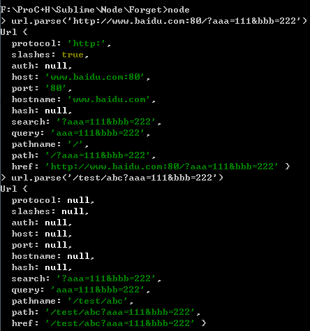
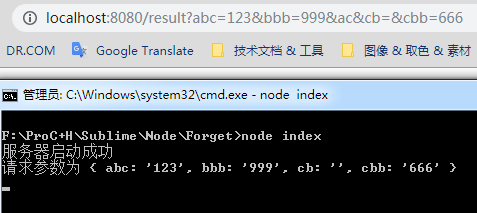

# Node.js中搭建HTTP服务器

本文将记录两种在Node.js中搭建简易HTTP服务器的方式，分别为使用原生代码方式搭建和用第三方框架 **express** 进行搭建。

## 原生代码方式搭建

### 搭建方法

原生搭建可引入Node.js自带的http模块，代码如下：

```js
var http = require('http');

var server = http.createServer();
server.on('request', function(req, res){
	console.log('已经收到请求');
	return res.end('Hello My Friend !');
});
server.listen(8080, function(){
	console.log('服务器启动成功');
});
```

其中 http.createServer 方法将返回一个Server对象，再通过事件监听机制在on方法上写回调函数即可处理http请求。当然，也可以将 **回调函数作为参数直接调用 http.createServer 方法**，即可用更简单的方式创建http服务器：

```js
var http = require('http');

http.createServer(function(req, res){
	console.log('已经收到请求');
	return res.end('Hello My Friend !');
})
.listen(8080, function(){
	console.log('服务器启动成功');
});
```

### 获取GET请求参数

在Node中，我们可以用自带的URL模块帮助解析URL字符串。如图所示：



因此，可以先通过 url 模块先对req.url初次解析，再通过手写js代码取出所有参数：

```js
var http = require('http');
var urlLib  = require('url');

http.createServer(function(req, res){
	var params = {};						//用来存储请求参数
	var query = urlLib.parse(req.url).query;	//取得所有参数的字符串
	if (query){ 							// query !== null
		var arr = query.split('&');
		arr.forEach(function(item, index){
			if(item.indexOf('=') > 0){
				var param = item.split('=');
				params[param[0]] = param[1];
			}
		});
	}
	console.log('请求参数为', params);
})
.listen(8080, function(){
	console.log('服务器启动成功');
});
```

运行结果如图：



### 获取POST请求参数

原生获取post请求中的参数相比get方式会稍有复杂，在http请求的回调函数参数中，可以指定request在data及end事件的回调。由于每次post请求的数据量无法保证，故当数据量很大的时候，Node将会多次调用 data事件回调函数，当数据接收完毕最后将触发end事件。代码如下：

```js
var http = require('http');

http.createServer(function(req, res){

	req.on('data', function(data){ // Post请求将触发该回调
		console.log('接收到数据', data);
	});

	req.on('end', function(){ //Post、Get最后均触发该回调
		console.log('接收数据完毕');
	});
	
	/* todo */
})
.listen(8080, function(){
	console.log('服务器启动成功');
});
```

**( 注：Get和Post请求最后都会触发end事件 )**

### 乱码问题

在建立http服务器响应请求的过程中，常会遇到服务器端响应中文而在浏览器却显示乱码问题。这主要是由服务器响应头 Content-Type 中没有指定编码所造成。因此，通过res.setHeader方法设置响应头即可：

```js
var http = require('http');

http.createServer(function(req, res){
	res.setHeader('Content-Type', 'text/plain; charset=utf-8');
	return res.end('该中文不会显示乱码');
})
.listen(8080, function(){
	console.log('服务器启动成功');
});
```


## Express 方式搭建

### 搭建方法

在使用npm安装express之后，通过以下代码便可创建并监听http服务器：

```js
var http = require('http');
var express = require('express');

var app = express(); //创建一个http应用
app.use(function(req, res, next){	//中间件函数	
	/* todo */
	next();
});

app.listen(8080, function(){console.log('服务器启动成功')});
```

更多关于express信息可参考源码或官方文档。

### 获取GET和POST请求参数

由于express的封装，get参数可以直接利用req.query获取。而Post请求可借助第三方包 body-parser ，调用req.body获取。详情见官方文档。

